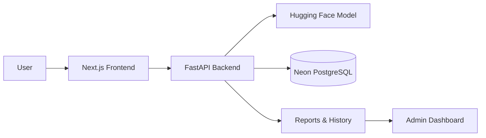

<div align="center">

# VerifiNews

### AI-Powered News Verification Platform

Analyze news articles with AI and get a **Real / Fake** prediction with a confidence score.

[](https://nextjs.org/)
[](https://fastapi.tiangolo.com/)
[](https://www.postgresql.org/)
[](https://huggingface.co/)

</div>

---

## Overview

**VerifiNews** is a full-stack AI news verification platform designed to help users analyze potentially misleading news content. Users can submit article text, receive an AI-generated classification with a confidence score, and keep track of previous analyses.

The platform also includes authentication, user profiles, reporting, detection history, and an admin dashboard for managing users and flagged content.

## Core Features

| Feature | Description |
|---|---|
| **AI Detection** | Analyze news content using a Hugging Face inference model |
| **Real / Fake Classification** | Get a predicted classification with confidence |
| **Authentication** | Secure signup, login, and user profiles |
| **Detection History** | Review previously analyzed articles |
| **Reporting** | Submit and manage flagged content |
| **Admin Dashboard** | Manage users, detections, and reports |
| **REST API** | FastAPI-powered backend with interactive API docs |

## Tech Stack

```text
Frontend     → Next.js · React · TypeScript
Backend      → Python · FastAPI
Database     → PostgreSQL · Neon
AI/ML        → Hugging Face
Deployment   → Vercel · Railway/Render · Neon
```

## Architecture



## Project Structure

```text
VerifiNews/
├── backend/              # FastAPI backend
├── frontend/             # Next.js frontend
├── DEPLOY.md             # Deployment guide
└── README.md
```

## Requirements

- Python 3.10+
- Node.js 18+
- npm
- PostgreSQL database (Neon recommended)
- Hugging Face account and API token

## Quick Start

### 1. Clone

```bash
git clone https://github.com/Eman2123/VerifiNews-.git
cd VerifiNews-
```

### 2. Backend

```bash
cd backend
python -m venv venv
```

**Windows:**

```bash
venv\Scripts\activate
```

**macOS/Linux:**

```bash
source venv/bin/activate
```

Install dependencies:

```bash
pip install -r requirements.txt
```

Create `.env` from `.env.example`:

```env
DATABASE_URL=your_neon_postgresql_url
SECRET_KEY=your_secret_key
HF_API_TOKEN=your_huggingface_token
HF_MODEL_URL=your_huggingface_model_url
FRONTEND_ORIGIN=http://localhost:3000
```

Start the API:

```bash
uvicorn app.main:app --reload
```

API docs: `http://localhost:8000/docs`

### 3. Frontend

Open a new terminal:

```bash
cd frontend
npm install
```

Create `.env.local` from `.env.local.example`:

```env
NEXT_PUBLIC_API_URL=http://localhost:8000
```

Start the frontend:

```bash
npm run dev
```

Open `http://localhost:3000` in your browser.

## How It Works

```text
Article Text
     │
     ▼
Next.js Frontend
     │
     ▼
FastAPI Backend
     │
     ▼
Hugging Face Model
     │
     ▼
Real / Fake + Confidence
     │
     ▼
Neon PostgreSQL
     │
     ▼
History / Reports / Admin
```

1. A user signs in or creates an account.
2. The user submits news/article text for analysis.
3. The backend sends the content to the configured Hugging Face model.
4. VerifiNews returns the predicted classification and confidence score.
5. The result is stored in the user's detection history.
6. Users can review previous checks and submit reports when needed.
7. Admins can manage users, detection logs, and flagged reports.

## Admin Access

Admin accounts are not created through normal signup. After creating an account, an administrator can assign the role through PostgreSQL:

```sql
UPDATE users SET role = 'admin' WHERE email = 'your-email@example.com';
```

Log out and sign in again after changing the role.

## Troubleshooting

| Problem | Possible Fix |
|---|---|
| `pip install` fails | Check that Python 3.10+ is installed |
| CORS error | Verify `FRONTEND_ORIGIN` matches the frontend URL |
| First detection is slow | The Hugging Face model may need to wake from a cold start |
| 401 after login | Check `NEXT_PUBLIC_API_URL` and restart the frontend |
| Database connection fails | Verify the Neon `DATABASE_URL` and SSL configuration |

## Deployment

See [`DEPLOY.md`](./DEPLOY.md) for production deployment instructions covering the database, backend, and frontend.

## Project Links

- **Repository:** [Eman2123/VerifiNews-](https://github.com/Eman2123/VerifiNews-)
- **API Documentation:** `http://localhost:8000/docs` when running locally
- **Deployment Guide:** [`DEPLOY.md`](./DEPLOY.md)

## License

This project is intended for educational and project demonstration purposes.

<div align="center">

---

**VerifiNews · AI-powered news verification**

</div>
